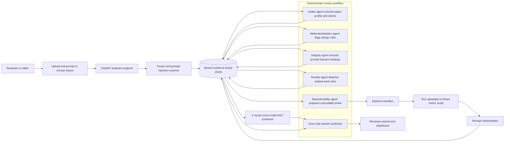

# RefereeOS

RefereeOS is a multi-agent preprint triage system for scientific editors and reviewers. It converts a manuscript into a structured evidence board, runs specialized review agents, executes one reproducibility probe in a Daytona sandbox, and produces a reviewer packet for human decision-making. It does not make final publication decisions.

## Why It Matters

Scientific review is overloaded, and AI-written manuscripts can increase volume while making weak work look polished. RefereeOS prepares peer review by surfacing claims, evidence, methodological risks, integrity issues, reproducibility receipts, and recommended reviewer expertise before scarce human review time is spent.

## Design Philosophy: Harness Engineering

RefereeOS follows OpenAI's **Harness Engineering** paradigm — investing in the engineering infrastructure *around* models rather than obsessing over prompt engineering. The model is a component, not the product. Each harness layer catches what a model alone would miss:

| Harness Layer | Implementation |
|---|---|
| **Evaluation Harness** | Structured JSON evidence board — every agent reads/writes against a shared schema, no raw model output reaches the reviewer packet |
| **Adversarial Harness** | 3-round cross-model review: DeepSeek v4-flash (Lead) drafts, Kimi kimi-k2.6 (Critic) critiques, Zhipu glm-4-flash (Scorer) issues final verdict |
| **Safety Harness** | Deterministic prompt-injection scanner with regex patterns and dangerous-import detection |
| **Observability Harness** | SSE streaming agent trace, every agent step timestamped and surfaced in real-time to the dashboard |
| **Reproducibility Harness** | Daytona sandbox executes untrusted code in isolation; local fallback for trusted fixtures only |
| **Degradation Harness** | Live Semantic Scholar → fixture fallback; Daytona → local fallback; missing models → self-review fallback |

## Sponsor Usage

- **AG2 Beta:** coordinates the multi-agent review workflow and powers the 3-round cross-model area-chair synthesis via `autogen.beta.Agent` with OpenAI-compatible configs.
- **Daytona:** runs the reproducibility probe in an isolated sandbox through the official Daytona Python SDK. The sandbox reruns the metric calculation script and returns a structured receipt.
- **DeepSeek v4-flash:** serves as the Lead agent in area-chair synthesis — drafts, revises, and finalizes the reviewer packet across all 3 rounds.
- **Kimi kimi-k2.6:** serves as the cross-model Critic in rounds 1–2, providing adversarial review from a different model perspective.
- **Zhipu glm-4-flash:** serves as the final Scorer in round 3, rating the synthesis 0–10 on completeness, accuracy, and actionability.

If Daytona or any model provider is unavailable during local development, RefereeOS uses clearly labeled deterministic fallbacks so the dashboard remains demoable.

## Agent Workflow Architecture



## Setup

Python 3.10+ required (AG2 requires `>=3.10, <3.14`).

```bash
git clone <repo-url> && cd RefereeOS
python -m venv .venv
.venv/bin/pip install -U pip
.venv/bin/pip install -r requirements.txt
npm install --prefix frontend
cp .env.example .env.local
```

### Two ways to run

RefereeOS is designed with graceful degradation — you can try it immediately without any API keys, or unlock the full 3-round cross-model review by adding your own.

#### Mode 1: Out of the box (no API keys needed)

The default `.env.example` config ships with `REFEREEOS_ENABLE_AG2_LLM=false`. No changes needed:

```bash
python main.py                          # Terminal 1: backend
npm --prefix frontend run dev           # Terminal 2: frontend
```

Open `http://127.0.0.1:5173`. What works:

| Feature | Status |
|---------|--------|
| Agent trace (6 steps, SSE streaming) | Full |
| Prompt-injection scanner | Full |
| Reproducibility probe (local fallback) | Full |
| Evidence board (claims / concerns / evidence) | Full |
| Reviewer packet generation | Deterministic mode |
| 3-round cross-model synthesis | Not available |

The deterministic mode generates the reviewer packet from the structured evidence board without calling any LLM. All outputs are clearly labeled as deterministic in the metadata.

#### Mode 2: Full experience (needs your own API keys)

Edit `.env.local` and set:

```txt
REFEREEOS_ENABLE_AG2_LLM=true

# DeepSeek (Lead agent — required for full mode)
DEEPSEEK_API_KEY=sk-...
DEEPSEEK_MODEL=deepseek-v4-flash
DEEPSEEK_BASE_URL=https://api.deepseek.com/v1

# Kimi (Critic — optional, falls back to DeepSeek self-critique)
KIMI_API_KEY=sk-...
KIMI_MODEL=kimi-k2.6
KIMI_BASE_URL=https://api.moonshot.cn/v1

# Zhipu (Scorer — optional, falls back to DeepSeek self-score)
ZHIPU_API_KEY=...
ZHIPU_MODEL=glm-4-flash
ZHIPU_BASE_URL=https://open.bigmodel.cn/api/paas/v4

# Daytona (optional, falls back to local subprocess)
DAYTONA_API_KEY=...
REFEREEOS_ALLOW_LOCAL_REPRO_FALLBACK=true
```

`DEEPSEEK_API_KEY` is the only hard requirement for full mode. Kimi and Zhipu gracefully fall back to DeepSeek if their keys are missing. Daytona falls back to a local subprocess.

Restart the backend, and the full 3-round cross-model review pipeline activates: DeepSeek drafts, Kimi critiques, Zhipu scores.

## Run

Terminal 1:

```bash
.venv/bin/python -m uvicorn backend.app:app --reload --reload-exclude "outputs/*" --host 127.0.0.1 --port 8000
```

Equivalent root launcher:

```bash
.venv/bin/python main.py
```

Terminal 2:

```bash
npm --prefix frontend run dev
```

Open `http://127.0.0.1:5173`.

Before a live sponsor demo, run:

```bash
.venv/bin/python scripts/preflight_demo.py
```

This verifies that Daytona can run code and that all model providers are reachable.

## Demo

Primary path:

1. Select **Suspicious/adversarial paper** and run review.
2. Show the agent trace, prompt-injection findings, Daytona receipt, and the 3-round cross-model review with critic scores.
3. Switch to **Clean computational paper** to show the control case where the artifact reproduces.

Expected outcomes:

- Clean fixture: `Ready for human review`, reproducibility `passed`, reported `0.87`, observed `0.87`.
- Suspicious fixture: `Possible integrity issue`, reproducibility `failed`, reported `0.91`, observed about `0.77`.

## Custom Reproducibility Path

For a non-fixture demo, upload:

- a manuscript: `.pdf`, `.md`, or `.txt`
- an artifact CSV
- a Python metric script
- the reported metric value

The metric script runs inside Daytona and should print one of these patterns:

```txt
macro_f1=0.87
metric=0.87
observed_result=0.87
```

For custom uploaded scripts, RefereeOS does not run a local fallback. If Daytona fails, the receipt is marked inconclusive instead of executing arbitrary uploaded code locally.

## API

- `POST /api/analyze` — standard analysis
- `POST /api/analyze-stream` — SSE streaming analysis with real-time agent trace
- `GET /api/runs/{run_id}` — get run metadata
- `GET /api/runs/{run_id}/packet` — get reviewer packet as markdown
- `GET /api/runs/{run_id}/evidence-board` — get raw evidence board JSON
- `GET /api/fixtures` — list available fixtures
- `GET /api/health` — health check

## Known Limitations

- Fixture-first flow is hardened; arbitrary PDF extraction is available through PyMuPDF but not deeply section-aware.
- Related-work search uses live Semantic Scholar API with fixture fallback for offline demo reliability.
- The local reproducibility fallback is for development only and is labeled in the receipt.
- AG2 synthesis is env-gated; deterministic packet generation remains the fallback when models are unavailable.
- Cross-model review requires all three model providers to be reachable; graceful degradation uses single-model self-review.
- The system prepares human review and must not be used as an autonomous publication decision maker.

## Open-Source Credits

- AG2: multi-agent framework
- Daytona: sandbox execution SDK
- FastAPI and Uvicorn: Python API runtime
- PyMuPDF: PDF text extraction
- Vite, React, and Lucide: frontend dashboard
- Semantic Scholar API: live paper search
- Harness Engineering paradigm: OpenAI
